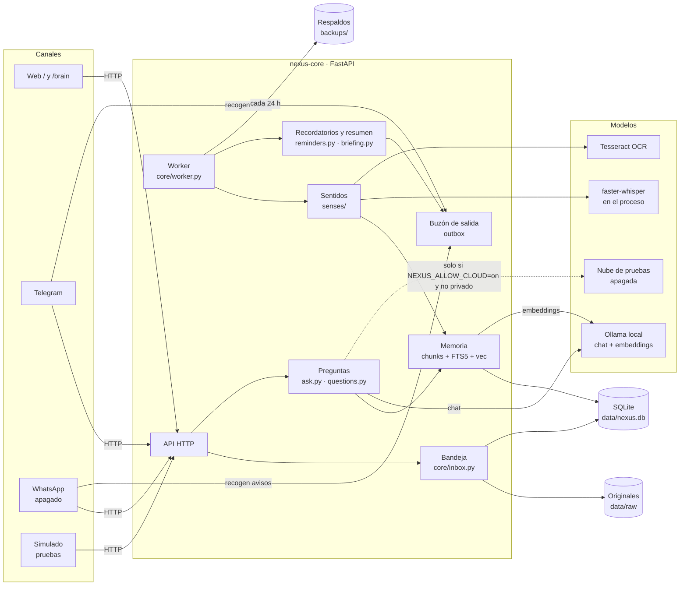

# Arquitectura

NEXUS es un asistente para el dueño de un negocio. Guarda todo lo que recibe, lo convierte en
memoria buscable y responde citando de dónde sale cada dato. Todo corre en Docker, en la
máquina del dueño o en su servidor.

## Vista general



Sin Mermaid (por ejemplo, en la terminal):

```
 Telegram ─┐                     ┌──────────────── nexus-core ────────────────┐
 WhatsApp ─┼── HTTP ──► API ──► bandeja ──► data/raw (original intacto)       │
 Web ──────┘    ▲              │    └──► events (SQLite)                      │
                │              │  worker: texto │ audio │ digestión │ avisos  │
                │              │      └─► senses/ ─► trozos ─► FTS5 + vectores│
           outbox ◄────────────│  /ask: preguntas por fecha │ búsqueda híbrida│
                               └───────────────┬────────────────────────────┘
                                               ▼
                                 Ollama (qwen2.5:1.5b, nomic-embed-text)
```

## Servicios (docker-compose.yml)

| Servicio | Qué hace | Puertos |
|---|---|---|
| `ollama` | Modelos locales: chat y embeddings. Versión fijada (`0.35.1`) | ninguno hacia afuera |
| `ollama-models` | Al arrancar, descarga los modelos que falten y termina | — |
| `core` | API, interfaz web, worker, sentidos, memoria | `127.0.0.1:8000` |
| `telegram` | Canal de Telegram por long polling (profile `channels`) | ninguno |
| `whatsapp` | Canal oficial de Meta, apagado (profile `whatsapp`) | `127.0.0.1:8081` |

Los puertos solo escuchan en `127.0.0.1`: desde otra máquina se entra por Tailscale o un túnel
SSH, nunca abriendo puertos a internet.

## Recorrido de un archivo

1. **Bandeja** (`core/inbox.py`): guarda el original en `data/raw/AAAA/MM/DD/`, calcula su
   SHA-256 (un duplicado no se guarda dos veces) y crea un `event` en estado `pending`.
2. **Worker** (`core/worker.py`): bucles independientes; uno no frena a otro.
   - Cola de **texto** (texto, documentos, imágenes) y cola de **audio** (audio y video).
   - **Digestión**: resumen y conceptos de cada elemento largo (`core/digest.py`).
   - **Programador**: recordatorios vencidos y resumen matutino → buzón de salida.
   - **Respaldo** cada `NEXUS_BACKUP_HOURS`.
3. **Sentidos** (`senses/`): un extractor por formato devuelve segmentos de texto con su origen
   (`pagina`, `hoja`, `fila`, `diapositiva`, `inicio`…). Ver [FORMATOS.md](FORMATOS.md).
4. **Troceado** (`core/chunker.py`): respeta títulos y secciones; cada trozo hereda el origen.
5. **Memoria** (`core/memory.py`): cada trozo va a `chunks`, al índice de palabras (FTS5) y al
   índice de vectores (sqlite-vec, distancia L2).
6. Estado final: `processed`, `empty` (sin texto), `unsupported` (con motivo) o `failed` tras
   `NEXUS_MAX_ATTEMPTS` intentos. Los tres últimos se reintentan desde la web o con `/requeue`.

## Recorrido de una pregunta

1. `core/questions.py` resuelve con SQL, sin búsqueda semántica, las preguntas por fecha
   ("¿qué aprendí ayer?"), "lo último que subí" y "¿qué sabes de X?".
2. Si no es de ese tipo, `core/search.py` combina palabras (FTS5) y significado (vectores) con
   Reciprocal Rank Fusion.
3. Filtro de relevancia: solo se usan trozos con distancia ≤ `NEXUS_MAX_DISTANCE`, o
   ≤ `NEXUS_MAX_DISTANCE + NEXUS_FTS_MARGIN` si además coinciden por palabras. Sin trozos
   relevantes, NEXUS dice que no lo sabe en vez de inventar.
4. `core/ask.py` arma el contexto y el modelo redacta. **Las citas las pone el código**
   (`core/citations.py`), no el modelo: "contrato.pdf, pág. 3", "ventas.xlsx, hoja Ventas, fila 12".

## Modelos y privacidad

| Tarea | Dónde corre | ¿Puede ir a la nube? |
|---|---|---|
| Chat de `/ask` y digestión | `providers/router.py`: Ollama remoto (opcional) → Ollama local | Solo con `NEXUS_ALLOW_CLOUD=on` y si no es privado ([MODO_NUBE.md](MODO_NUBE.md)) |
| Embeddings | Ollama local, siempre | Nunca |
| Audio y video | faster-whisper dentro de `core` | Nunca |
| OCR y visión | Tesseract y Ollama local | Nunca |
| Recordatorios y resumen matutino | Ollama local | Nunca |

No hay telemetría. Lo único que sale a internet: descargas de modelos, la API de Telegram si el
canal está activo y la nube de pruebas si la enciendes.

## Datos

| Ubicación | Contenido | ¿Se puede regenerar? |
|---|---|---|
| `data/raw/` | Originales intactos | No: es la fuente de verdad |
| `data/nexus.db` → `events` | Qué entró, cuándo, estado y motivo | No |
| `chunks`, `chunks_fts`, `vec_chunks` | Trozos, índice de palabras y vectores | Sí, con `POST /reindex` |
| `digests` | Resúmenes y conceptos | Sí, con `/reindex` o `/requeue/digests` |
| `reminders`, `outbox`, `kv` | Recordatorios, avisos por enviar, ajustes internos | No |
| `backups/` | Copias verificadas de la base y espejo de `raw` | — |

SQLite trabaja en modo WAL con `busy_timeout` de 30 s: la API y el worker escriben a la vez
sin bloquearse.

## Perfiles

El núcleo no sabe de ventas. Nombre del asistente, tono, categorías, reglas proactivas y
ejemplos salen de `profiles/<NEXUS_PROFILE>.toml` ([PERFILES.md](PERFILES.md)).

## Carpetas

```
core/        API, bandeja, worker, memoria, preguntas, interfaz web
senses/      un extractor por formato (texto, documentos, oficina, correo, imagen, audio, zip)
providers/   modelos: Ollama, remoto con respaldo, nube de pruebas, embeddings
channels/    Telegram, WhatsApp, simulado y la conversación común (assistant.py)
config/      lectura de variables de entorno
profiles/    perfiles de rubro (.toml)
tests/       e2e, pruebas unitarias, fixtures y calibración del umbral
docs/        esta documentación
```
